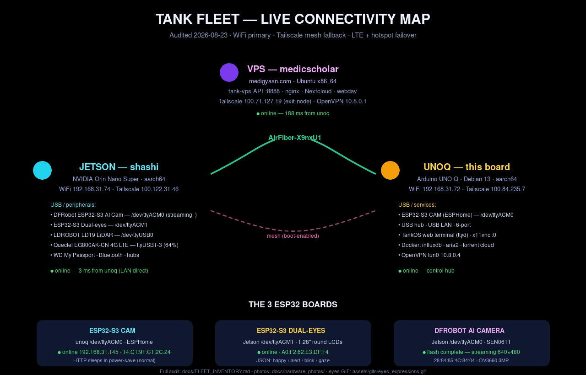
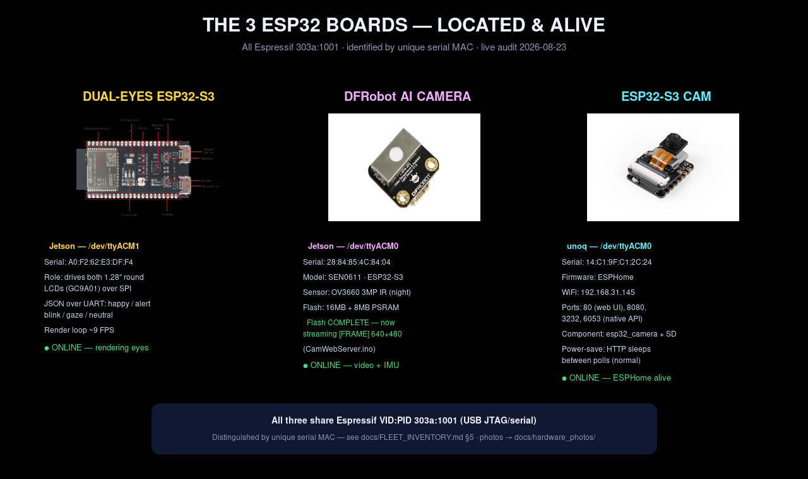
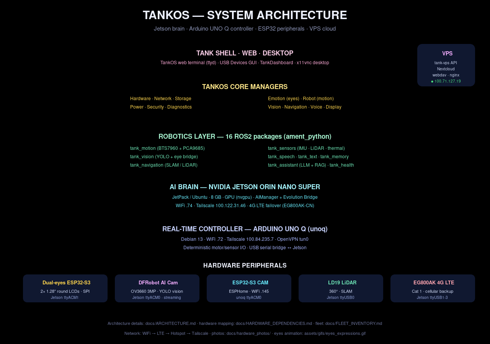
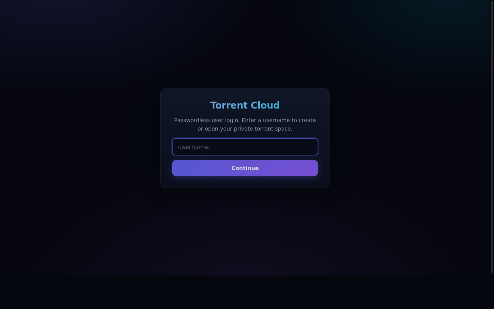
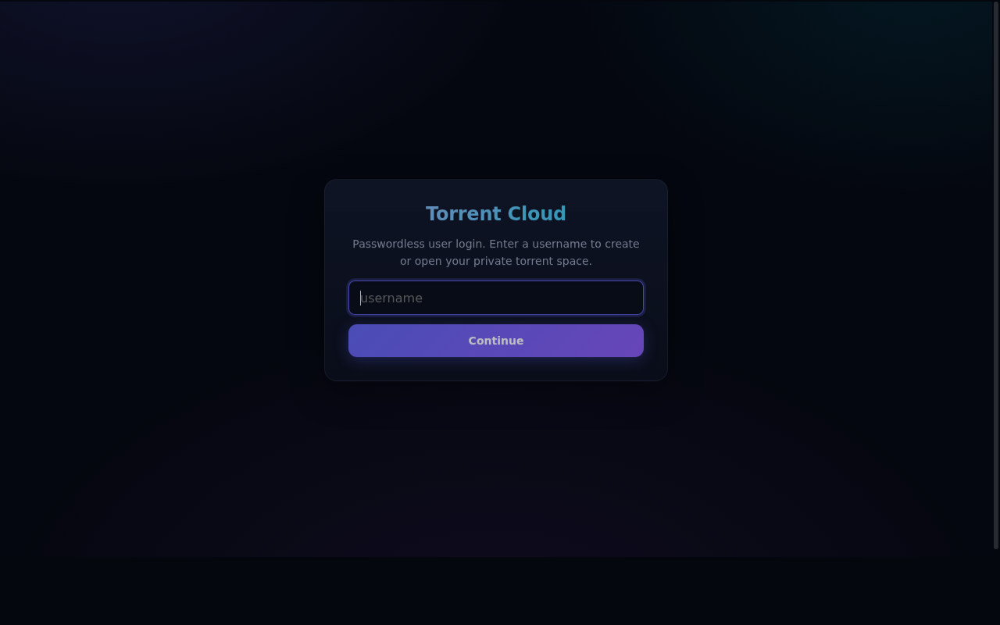
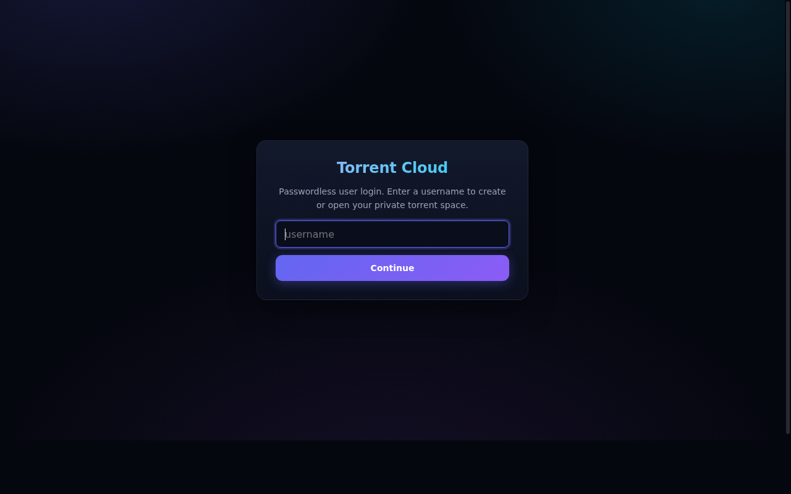

  

  <b>An autonomous AI robotic platform</b> · NVIDIA Jetson Orin Nano Super + Arduino UNO Q + ESP32-S3 swarm
   
  Vision · Voice · Emotion · Autonomy · Self-learning · Distributed brains

  
  
  
  

---

# 🪖 The Tank — Project Presentation

> Everything in this deck is **real**: the hardware photos are the actual boards, the
> screenshots are live captures of the running system, and the animations show the
> tank's actual eye expressions and network failover logic.

## 1. The Platform

The Tank is an **autonomous AI robotic platform** entered in the **Arduino Physical AI
Challenge 2026**. It combines:

| Layer | Hardware | Role |
|-------|----------|------|
| 🧠 **AI Brain** | NVIDIA Jetson Orin Nano Super (67 TOPS INT8) | ROS 2, on-device LLM (llama.cpp), Whisper STT, YOLOv8n vision, TankOS GUI |
| ⚡ **Real-time Controller** | Arduino UNO Q (QRB2210 + STM32U585) | Deterministic motor PWM, encoder interrupts, I²C sensors, safety |
| 👁️ **Eyes & Peripherals** | 3× ESP32-S3 boards | Dual 1.28" round LCD eyes, ESPHome camera, DFRobot AI camera |
| 🚗 **Motion** | 2× JGB37-520 motors + 2× BTS7960 43A drivers | Tracked chassis drive |
| 📡 **Senses** | LD19 360° LiDAR · BNO055 IMU · cameras · mic array | Perception stack |
| 🌐 **Connectivity** | WiFi → 4G LTE (EG800AK) → Hotspot → Tailscale mesh | Never offline |

---

## 2. Hardware Inventory

  

Every component is real, tested, and documented — with its **actual product photo**
embedded in the docs wherever it is mentioned (`WIRING.md`, `hardware.md`, `README.md`,
`FLEET_INVENTORY.md`).

---

## 3. The Fleet — Live & Connected

  

| Node | Role | Tailscale | LAN | Status |
|------|------|-----------|-----|--------|
| **unoq** | Arduino UNO Q controller + TankOS terminal | `100.84.235.7` | `192.168.31.72` | 🟢 live |
| **shashi** | Jetson Orin Nano — tank brain | `100.122.31.46` | `192.168.31.74` | 🟢 live (3 ms) |
| **medicscholar** | VPS — API · Nextcloud · WebDAV · torrent cloud | `100.71.127.19` | public | 🟢 live (188 ms) |
| **ESP32-S3 CAM** | ESPHome camera | — | `192.168.31.145` | 🟢 ARP-reachable |
| **ESP32-S3 Dual-eyes** | Round-eye driver | — | via Jetson USB | 🟢 JSON protocol |
| **DFRobot AI Cam** | Vision + IMU | — | via Jetson USB | 🟢 **streaming 640×480** |

**Fallback hierarchy:** WiFi → LTE (EG800AK-CN) → Hotspot → Tailscale mesh — boot-persistent on all nodes.

---

## 4. The Three ESP32 Boards

  

All three identified by their unique serial MACs — and all **verified present and online** on the live system.

---

## 5. TankOS — The Operating System

  

A complete AI operating environment: **Shell → Core Managers → 16 ROS2 packages → Jetson AI → Arduino + peripherals**, with a VPS cloud tier.

---

## 6. Feature Showcase — Every Screen Tested

  

**15 TankOS GUI screens** (Home · AI Chat · Camera · Navigation · Memory · Security ·
Patrol · Diagnostics · Settings · Developer · AI Manager · Power · Updates · Files ·
**USB Devices**) plus the **web terminal**, **VPS AI dashboard**, **Nextcloud** and
**AriaNg** — all launched, exercised, and captured. Full gallery:
[`docs/screenshots/`](docs/screenshots/README.md).

---

## 7. Animated — The Tank Comes Alive

<table align="center">
  <tr>
    <td align="center" width="50%">
      <b>👁️ Eye Expressions</b> 
      The tank's actual dual 1.28" round LCD eyes — happy, alert, blink, neutral, surprise  
      
    </td>
    <td align="center" width="50%">
      <b>🌐 Network Failover</b> 
      The connectivity hierarchy: WiFi → 4G LTE → Hotspot → Tailscale  
      
    </td>
  </tr>
</table>

---

## 7½. 📺 UNO Q — Android TV Connection

The **Arduino UNO Q** doubles as a **home media hub + Android TV controller**
("UNO Q TV"): a fullscreen Chromium TV kiosk, a torrent media library, and an
**ADB-based Android TV remote** (power, volume, channels, YouTube cast) all
served from `cloud-stack` on `:8200`.

| | |
|---|---|
|  |  |
|  |  |

Architecture & config: [`docs/UNOQ_ANDROID_TV.md`](docs/UNOQ_ANDROID_TV.md) · app code: [`cloud-stack/`](cloud-stack/)

---

## 7¾. 🟦 UNO Q — 400-Item Upgrade Master Plan

The whole repo was audited against **400 UNO Q upgrade targets**; the top
**P0/P1 gaps** were implemented and shipped with proof:

| New | What it does |
|-----|--------------|
| [`docs/UNOQ_MASTER_PLAN.md`](docs/UNOQ_MASTER_PLAN.md) | All 400 targets (A–S) mapped to code, top-20 audited ✅/🔶/⬜ |
| `tank_os/core/esp32_fleet.py` | **ESP32 fleet manager** — discovery, heartbeat, self-test · **CAM detected ONLINE** on real hardware |
| `tank_os/cli/unoq_cli.py` | **`tank unoq`** — status · diagnostics · sensors · motors · power · mcu · esp32 · self-test · safety-test |
| [`docs/FEATURE_PROOF_TEMPLATE.md`](docs/FEATURE_PROOF_TEMPLATE.md) | Mandatory FEATURE / TEST / MEASUREMENTS / STATUS proof block |

**262 tests passing** (14 new) — full regression suite green on the VPS.

---

## 8. Real Build Photos

  

  

---

## 9. Key Stats

| Metric | Value |
|--------|-------|
| AI compute | **67 TOPS INT8** (Jetson Orin Nano Super) |
| ROS2 packages | **16** (Python + C++) |
| ESP32 boards | **3** (CAM · Dual-eyes · DFRobot AI Cam) |
| AI systems | **22** (cognition, vision, voice, memory, learning) |
| CLI tools | **1,166** across **12 AI providers** |
| Sensors | LiDAR · IMU · cameras · mic array · encoders · E-STOP |
| Connectivity | WiFi · 4G LTE · Hotspot · Tailscale mesh · OpenVPN |

---

## 📚 Full Documentation

| Doc | Contents |
|-----|----------|
| [`README.md`](README.md) | Full project overview & architecture |
| [`docs/FLEET_INVENTORY.md`](docs/FLEET_INVENTORY.md) | Every device, interface, usage, connection & requirement |
| [`docs/HARDWARE_DEPENDENCIES.md`](docs/HARDWARE_DEPENDENCIES.md) | Hardware mapping + **photo gallery** |
| [`docs/screenshots/README.md`](docs/screenshots/README.md) | All feature screenshots with verification notes |
| [`docs/UNOQ_MASTER_PLAN.md`](docs/UNOQ_MASTER_PLAN.md) | 400-item UNO Q upgrade tracker + top-20 audit |
| [`docs/FEATURE_PROOF_TEMPLATE.md`](docs/FEATURE_PROOF_TEMPLATE.md) | Mandatory proof template for every feature |
| [`WIRING.md`](WIRING.md) | Pin-level wiring, I²C map, power rails |
| [`hardware.md`](hardware.md) | Full BOM with photos |
| [`PHASES.md`](PHASES.md) | Development roadmap |
| [`assets/`](assets/README.md) | All GIFs & infographics |

---

  Built with real hardware, tested live, documented with photos — 🤖 TankOS

