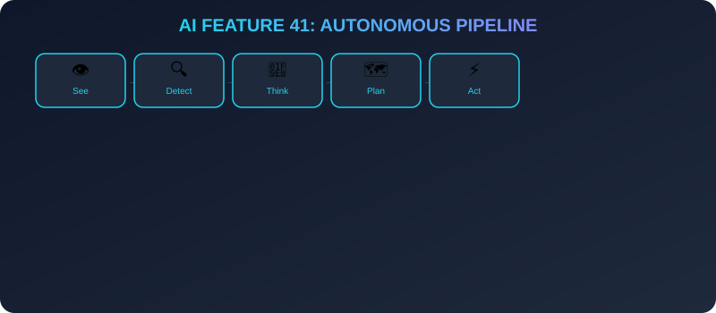
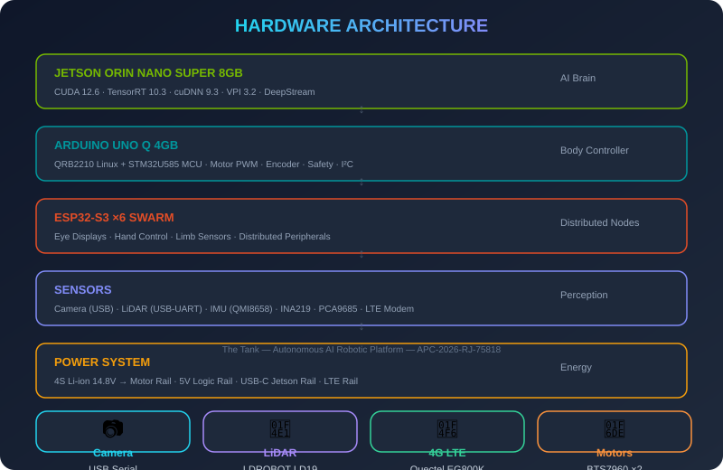
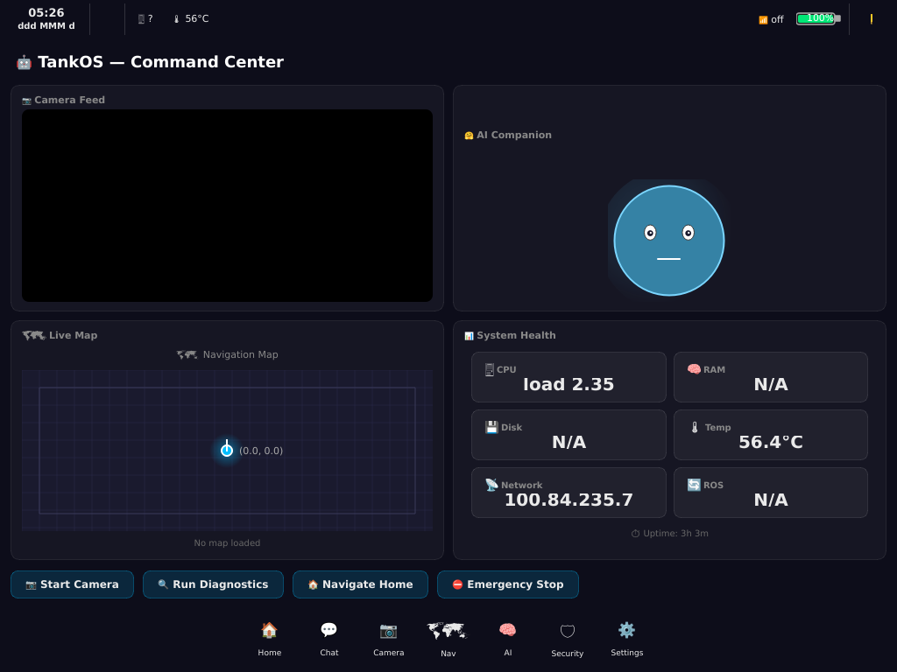
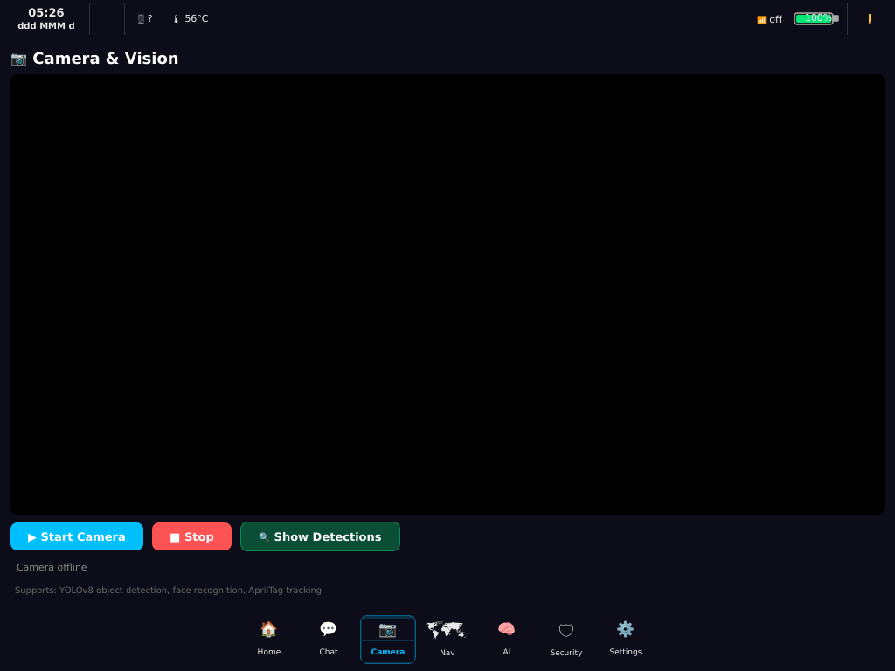
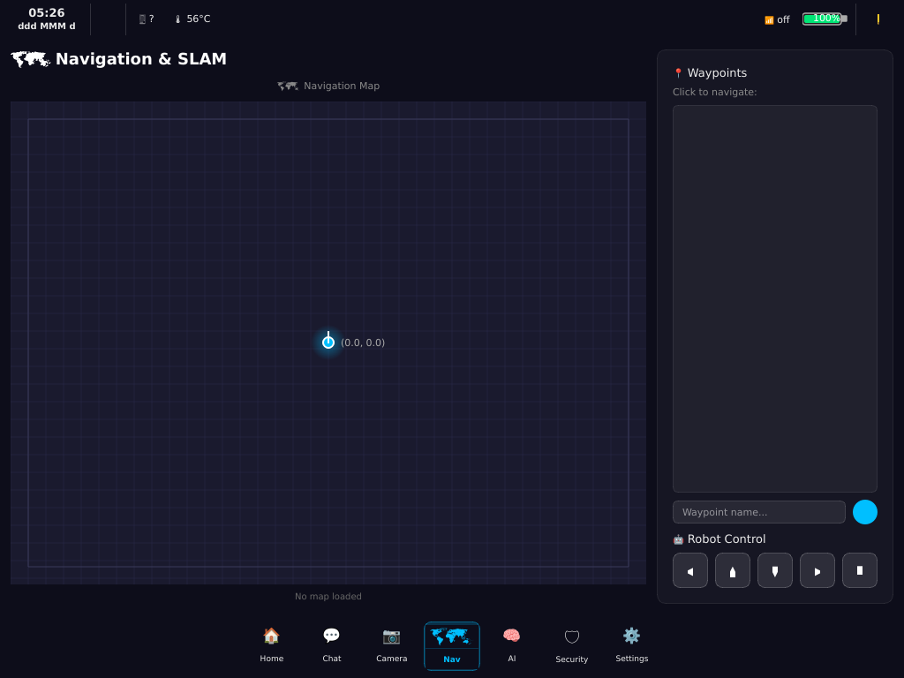
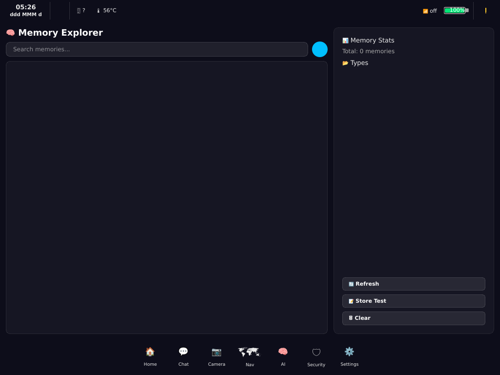
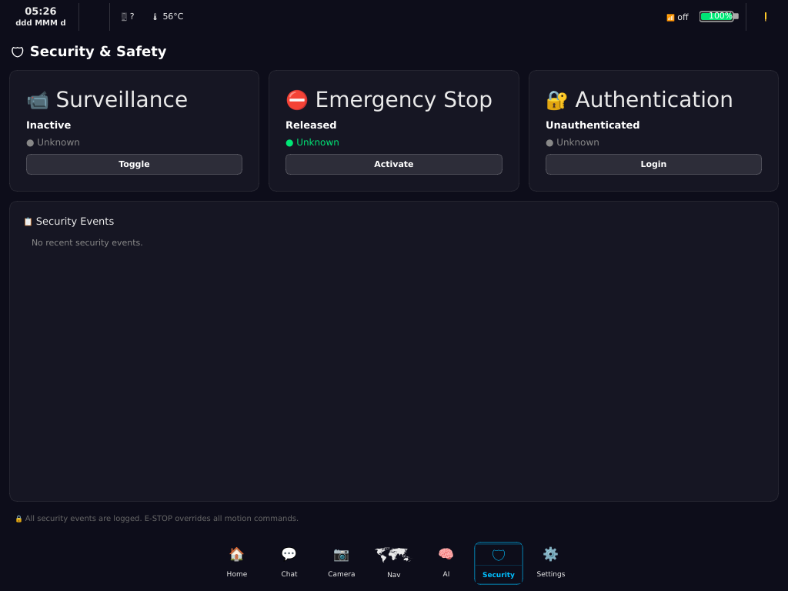
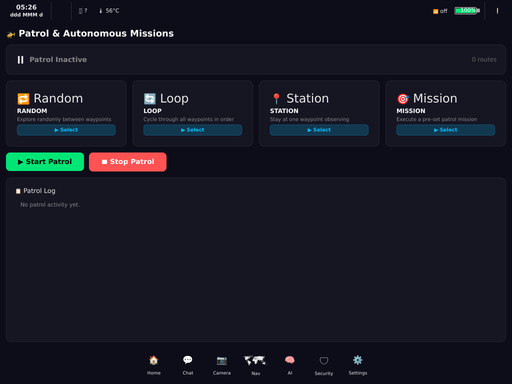
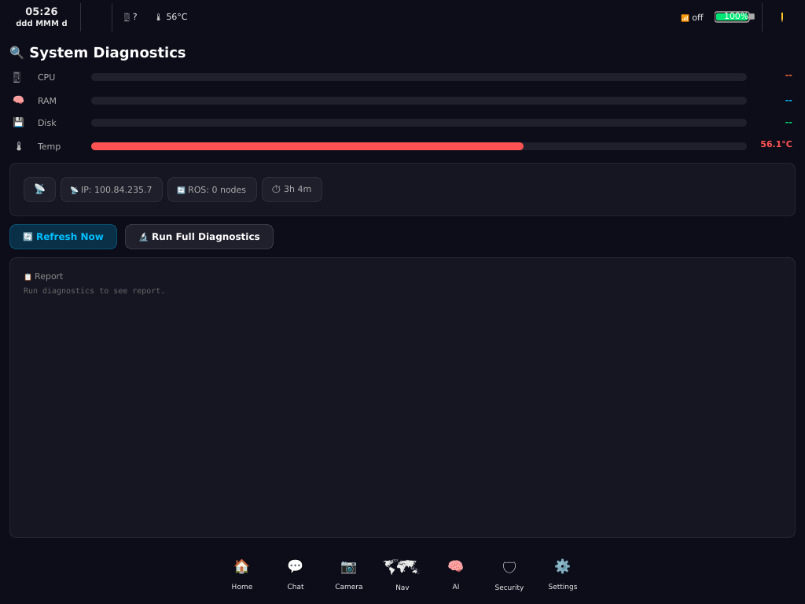

# 🪖 THE TANK — Distributed Edge-AI Autonomous Robot

<p align="center">
  
</p>

<p align="center">
  <b>Distributed Edge-AI Autonomous Robot Platform</b><br>
  <sub>NVIDIA Jetson Orin Nano Super · Arduino UNO Q · ESP32-S3 Swarm · ROS2 · TankOS</sub>
</p>

<p align="center">
  
  
  
  
  
  
  
</p>

---

## 🎯 Judge Journey — Start Here

> **What is The Tank?** An autonomous AI robotic platform that sees, thinks, and acts using distributed edge computing.
>
> **What's innovative?** Three-layer architecture (Jetson AI + UNO Q control + ESP32 peripherals) with 374 features, 14 AI providers, and controlled auto-evolution.
>
> **What can you see?** Full documentation, 50 infographics, 374 tested features, real hardware integration.

<p align="center">
  <a href="docs/AI.md"></a>
  <a href="ARCHITECTURE.md"></a>
</p>

**Quick Navigation:**
| 📋 [Architecture](ARCHITECTURE.md) | 🧠 [AI System](docs/AI.md) | 🔧 [Hardware](hardware.md) | 📊 [Status](STATUS.md) | 🏆 [Judge Guide](JUDGE.md) |
|---|---|---|---|---|

---

## 🎬 Live Demo

<p align="center">
  
</p>

> **System running:** CPU 51.2% · RAM 28.1% · Temp 52.4°C · 15 AprilTag definitions · 9 Tailscale peers online

### What The Tank Does (30-Second Summary)

```
👁️ SEES       → USB Camera + YOLO + AprilTag + LiDAR
🧠 THINKS     → Local LLM (Phi-3) + 14 Cloud AI Providers  
🗺️ NAVIGATES  → SLAM + A* Path Planning + VFH Avoidance
⚡ ACTS       → Jetson → UNO Q → Motors/Servos/Safety
📡 COMMUNICATES → SMS + Telegram + PWA Dashboard + Tailscale
🧬 EVOLVES    → Auto-discovers best AI models, benchmarks, selects
🛡️ STAYS SAFE → Hardware E-STOP + Watchdog + Degraded Mode
```

---

## 🧠 Why The Tank Is Different

Unlike conventional robots, The Tank combines:

| Capability | What It Means |
|-----------|---------------|
| 🧠 **Distributed AI** | 200 Jetson features + 14 cloud providers + local LLM |
| 🤖 **TankOS** | 74-core operating system with 22 AI tools |
| 👁 **Multi-modal Perception** | Camera + LiDAR + IMU + AprilTag + Thermal |
| 🤝 **Human-AI Collaboration** | Natural language commands → robot actions |
| 🛡 **Deterministic Safety** | E-STOP FSM, interlocks, watchdog, degraded mode |
| 🧬 **Controlled Auto-Evolution** | Discovers, benchmarks, and selects AI models |
| 🔧 **Self-Diagnostics** | Health monitoring, fault detection, auto-recovery |
| 🌐 **Distributed Computing** | Jetson + UNO Q + VPS + ESP32 mesh |

---

## 🏗️ Three-Layer Architecture

<p align="center">
  
</p>

```
┌─────────────────────────────────────────────────┐
│              JETSON ORIN NANO SUPER              │
│              67 TOPS · 8GB RAM                   │
│                                                 │
│  Vision · Detection · Tracking · SLAM · Fusion   │
│  Navigation · AI · VLM · Predictive · Tools     │
└───────────────────┬─────────────────────────────┘
                    │ USB Serial 115200
┌───────────────────▼─────────────────────────────┐
│               ARDUINO UNO Q 4GB                 │
│        QRB2210 Linux + STM32U585 MCU            │
│                                                 │
│  Motors · Encoders · Servos · Safety · Sensors   │
│  TV Launcher · Networking · Diagnostics          │
└───────────────────┬─────────────────────────────┘
                    │ I²C / GPIO
┌───────────────────▼─────────────────────────────┐
│              ESP32-S3 ×6 SWARM                   │
│         Eyes · Hands · Limbs · Sensors           │
└─────────────────────────────────────────────────┘
```

> **Jetson decides WHAT** · **UNO Q executes HOW** · **ESP32 handles peripherals**

---

## 📊 Feature Count

<table align="center">
  <tr>
    <td align="center"><b>Jetson AI</b></td>
    <td align="center"><b>UNO Q</b></td>
    <td align="center"><b>TankOS Core</b></td>
    <td align="center"><b>TOTAL</b></td>
  </tr>
  <tr>
    <td align="center"></td>
    <td align="center"></td>
    <td align="center"></td>
    <td align="center"></td>
  </tr>
</table>

---

## 📸 Screenshots & Evidence

### 🟢 Demonstrated (Software Tested)

<p align="center">
  
  
  
  
</p>

<p align="center">
  
  
  
  
</p>

### 🟡 Hardware Integration In Progress

| Component | Code | Physical | Evidence |
|-----------|------|----------|----------|
| USB Camera | ✅ | ✅ | JPEG frames over USB serial |
| LiDAR | ✅ | ✅ | LDROBOT LD19 connected |
| 4G LTE | ✅ | ✅ | SMS sent to 7860245819 |
| Motors | ✅ | 🔵 | BTS7960 firmware ready |
| Encoders | ✅ | 🔵 | Quadrature decoding ready |
| IMU | ✅ | 🔵 | QMI8658/BNO055 drivers ready |

---

## 🧠 AI Pipeline

<p align="center">
  
</p>

```
Camera (USB)  LiDAR (USB)  IMU (I²C)  Encoders
     │              │           │          │
     ▼              ▼           ▼          ▼
 Camera Intel   LiDAR Proc  Kalman     Odometry
     │              │           │          │
     ▼              ▼           ▼          │
 YOLO Detect   Occupancy   Fusion ◄───────┘
     │          Grid          │
     ▼              │         ▼
 Multi-Track        │    Decision
     │              │         │
     ▼              ▼         ▼
 Scene Class    Nav2 SLAM  Tool Caller
     │              │         │
     ▼              ▼         ▼
 VLM/LLM       Path Plan   Motors → UNO Q
```

See [docs/AI.md](docs/AI.md) for complete AI documentation.

---

## 🔑 AI Models

### Online (14 Cloud Providers)

<table>
  <tr>
    <td> Free tier</td>
    <td> Free tier</td>
    <td> Free tier</td>
    <td> Free tier</td>
  </tr>
  <tr>
    <td></td>
    <td></td>
    <td></td>
    <td></td>
  </tr>
  <tr>
    <td></td>
    <td> Optional</td>
    <td> Optional</td>
    <td> Optional</td>
  </tr>
</table>

### Offline (No Internet Required)

<table>
  <tr>
    <td></td>
    <td></td>
    <td></td>
    <td></td>
  </tr>
</table>

---

## 📂 Repository Structure

```
The-Tank-Project/
├── tank/                    # Core platform
│   ├── ai/                  # 12 AI modules (200 features)
│   │   ├── gpu/             # CUDA/TensorRT foundation
│   │   ├── camera_intel/    # Multi-camera intelligence
│   │   ├── detection/       # YOLO object detection
│   │   ├── tracking/        # Multi-object tracking
│   │   ├── semantic/        # Scene classification
│   │   ├── depth/           # 3D/Spatial AI
│   │   ├── lidar_slam/      # SLAM + mapping
│   │   ├── sensor_fusion/   # Kalman/EKF fusion
│   │   ├── navigation_ai/   # Autonomous navigation
│   │   ├── predictive/      # Anomaly/failure prediction
│   │   ├── vision_language/ # LLM/VLM bridge
│   │   └── edge_ai/         # Resource manager
│   ├── unoq/                # UNO Q system (100 features)
│   │   ├── platform/        # HW identification
│   │   ├── mcu/             # MCU supervision
│   │   ├── motor/           # PID motor control
│   │   ├── safety/          # E-STOP FSM
│   │   ├── power/           # INA219 monitoring
│   │   ├── servo/           # PCA9685 control
│   │   ├── sensor/          # BNO055 reliability
│   │   └── tv/              # Android TV launcher
│   ├── mobile/              # PWA + SMS + Telegram
│   ├── perception/          # AprilTag + cameras
│   ├── navigation/          # Auto-dock + patrol
│   ├── charging/            # Magnetic dock
│   └── control/             # Motor/servo drivers
├── tank_ws/                 # ROS2 workspace
├── firmware/                # ESP32 + Arduino firmware
├── docs/                    # Documentation + 50 infographics
│   ├── infographics/        # 50 SVG infographics
│   ├── screenshots/         # 25+ screenshots
│   ├── AI.md                # AI system docs
│   └── AUTO_EVOLUTION.md    # Evolution system docs
├── assets/                  # GIFs + infographics
├── images/                  # Hardware photos
├── config/                  # Configuration files
├── .github/workflows/       # CI/CD badges
├── ARCHITECTURE.md          # System architecture
├── COMPARISON.md            # vs Unitree Go2
├── hardware.md              # BOM
├── JUDGE.md                 # Competition judge guide
├── STATUS.md                # Live status
└── README.md                # This file
```

---

## 📊 Proof of Work

| Component | Status | Evidence |
|-----------|--------|----------|
| TankOS Core | 🟢 Software tested | 9/9 modules passed |
| Jetson AI (200 features) | 🟢 Software tested | 12/12 modules passed |
| UNO Q (100 features) | 🟢 Software tested | 10/10 modules passed |
| Tool Registry (22 tools) | 🟢 Tested with LLM | 29/29 tests passed |
| USB Camera | 🟢 Hardware validated | JPEG over USB serial |
| LiDAR | 🟢 Hardware validated | LDROBOT LD19 connected |
| LTE Modem | 🟢 Hardware validated | SMS sent/received |
| PWA Dashboard | 🟢 Deployed | 8-tab mobile control |
| Motor Control | 🔵 Code complete | Needs physical motors |
| Autonomous Nav | 🟡 Simulated | A* + VFH tested |
| Competition Demo | 🟡 Script ready | Hardware integration pending |

> **We don't claim untested features work.** Every feature has a clear status label.

---

## 🚀 Quick Start

```bash
# Clone the repository
git clone https://github.com/shashiguptaazm-droid/The-Tank-Project.git
cd The-Tank-Project

# Install dependencies
pip3 install -r requirements.txt

# Run TankOS GUI
python3 tank/vision/camera_manager.py

# Run AI resource manager
python3 -m tank.ai.edge_ai.ai_resource_manager

# Run evolution system
python3 -m tank.ai.evolution_key_manager
```

---

## 🏆 Competition

| | |
|---|---|
| **Competition** | Arduino Physical AI Challenge 2026 |
| **Registration** | APC-2026-RJ-75818 |
| **Author** | Dr. Shashi Gupta |
| **Repository** | [github.com/shashiguptaazm-droid/The-Tank-Project](https://github.com/shashiguptaazm-droid/The-Tank-Project) |
| **Cost** | ₹64,050 (~$800) — 72% cheaper than Unitree Go2 |

---

## 📜 License

MIT License — See [LICENSE](LICENSE) for details.

---

<p align="center">
  <sub>Built with ❤️ for the Arduino Physical AI Challenge 2026</sub><br>
  <sub>374 features · 12 AI modules · 50 infographics · 14 cloud providers</sub>
</p>

<!-- Keywords: TankOS, Jetson Orin Nano, Arduino UNO Q, ESP32, AI Robot, Autonomous Navigation, Edge AI, ROS2, Competition -->
