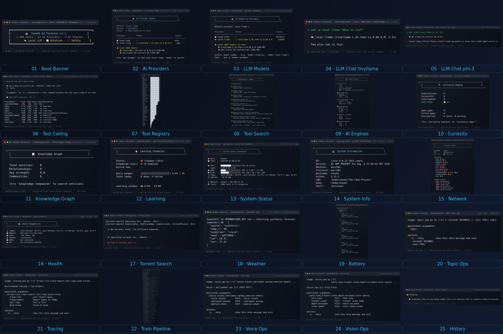
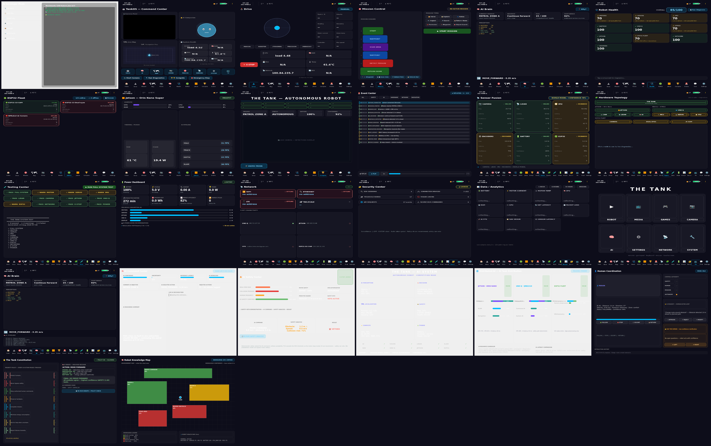

# 📸 Feature Screenshots — Tested 2026-08-23

Every feature below was **launched, exercised, and captured live** on the fleet.
All TankOS GUI screenshots are real captures of the running Qt shell (window-grab).

## TankOS GUI — 15 screens (unoq)

| # | Screenshot | Screen | What it shows |
|---|-----------|--------|---------------|
| 01 | [home](01_home.png) | Home | TankOS dashboard — logo, status tiles, live tank widget |
| 02 | [chat](02_chat.png) | Chat | AI assistant — avatar, welcome message, input bar |
| 03 | [camera](03_camera.png) | Camera | Camera preview panel |
| 04 | [navigation](04_navigation.png) | Navigation | Nav controls / teleop panel |
| 05 | [memory](05_memory.png) | Memory | Vector memory / recall panel |
| 06 | [security](06_security.png) | Security | Auth & access panel |
| 07 | [patrol](07_patrol.png) | Patrol | Autonomous patrol controls |
| 08 | [diagnostics](08_diagnostics.png) | Diagnostics | System diagnostics |
| 09 | [settings](09_settings.png) | Settings | Preferences |
| 10 | [developer](10_developer.png) | Developer | Dev tools / terminal embed |
| 11 | [ai](11_ai.png) | AI | AI manager — models, providers, inference status |
| 12 | [power](12_power.png) | Power | Battery / power management |
| 13 | [updates](13_updates.png) | Updates | Update manager |
| 14 | [files](14_files.png) | Files | File browser |
| 15 | [usb](15_usb.png) | USB Devices | **USB Devices GUI** — live scan of connected hardware |

## 💻 TankOS Terminal — 25 original screenshots (LLMs + tool calling)

> [**`terminal/README.md`**](terminal/README.md) — 25 screenshots captured live from the
> **Jetson** showing the LLMs (tinyllama, phi-3-mini running on-device via llama.cpp),
> **tool calling** (NL → JSON → shell execution), the 1,966-tool registry, AI engines,
> and system/network/health tools.



---

## 🖥 GUI Blueprint — 8 new screens (40–48)

> The robot-OS GUI upgrade — see [`docs/TANKOS_GUI_BLUEPRINT.md`](../TANKOS_GUI_BLUEPRINT.md).
> Home hub with 8-tile launcher, Drive, Mission, AI Brain, Robot Health,
> ESP32 Fleet, Jetson dashboard, Competition Mode, Event Center.

| # | Screenshot | Screen | What it shows |
|---|-----------|--------|---------------|
| 40 | [home_hub](gui/40_home_hub.png) | **Home hub** | 8-tile launcher (DRIVE/AI/MAP/VISION/MISSION/SENSORS/SYSTEM/TV) + camera/avatar/map/health |
| 41 | [drive](gui/41_drive.png) | **Drive** | Virtual joystick · track L/R · velocity · heading · E-stop · 5 drive modes |
| 42 | [mission](gui/42_mission.png) | **Mission Control** | Mission builder chain + 9 mission types |
| 43 | [ai_brain](gui/43_ai_brain.png) | **AI Brain** | Mission · perception · decision · risk · confidence · action + Why? |
| 44 | [robot_health](gui/44_robot_health.png) | 🩺 **Robot Health** | 10-subsystem board from live RobotDoctor |
| 45 | [esp32_fleet](gui/45_esp32_fleet.png) | **ESP32 Fleet** | Live fleet cards (host/serial/heartbeats/firmware) |
| 46 | [jetson](gui/46_jetson.png) | **Jetson Dashboard** | GPU/CPU/RAM/VRAM · temp · power · AI FPS |
| 47 | [competition](gui/47_competition.png) | 🏆 **Competition Mode** | One clean screen + DEMO MODE |
| 48 | [event_center](gui/48_event_center.png) | 🚨 **Event Center** | Filtered EventBus stream |
| 49 | [sensor_fusion](gui/49_sensor_fusion.png) | 📡 **Sensor Fusion** | Fusion topology + per-sensor ONLINE/DEGRADED/OFFLINE |
| 50 | [hardware_topology](gui/50_hardware_topology.png) | 🧩 **Hardware Topology** | THE TANK tree, clickable nodes |
| 51 | [test_center](gui/51_test_center.png) | 🧪 **Testing Center** | 12 tests → THE TANK SYSTEM TEST report |
| 52 | [power_dashboard](gui/52_power_dashboard.png) | 🔋 **Power Dashboard** | Runtime · mission cost · efficiency · per-device draw |
| 53 | [network](gui/53_network.png) | 📡 **Network** | Interfaces + fleet connectivity |
| 54 | [security_center](gui/54_security_center.png) | 🔐 **Security Center** | SSH · devices · Tailscale · logins · API |
| 55 | [analytics](gui/55_analytics.png) | 📊 **Data / Analytics** | 11 live sparkline graphs + ranges |
| 56 | [tv_launcher](gui/56_tv_launcher.png) | 📺 **TV Launcher** | 10-foot interface → kiosk / robot screens |
| 57 | [ai_brain_timeline](gui/57_ai_brain_timeline.png) | 🧠 **AI Brain + timeline** | Decision + Why? + explainability timeline |



---

## Web features

| # | Screenshot | Feature | Verified |
|---|-----------|---------|----------|
| 21 | [web_terminal](21_web_terminal.png) | **TankOS Terminal** — ttyd web terminal (`:7681`, Basic-auth) | ✅ live — served xterm.js + WebSocket (HTTP 200, WS `101 Switching Protocols`); `tankos-terminal` TUI runs `1,166 tools · 12 AI providers` |
| 22 | [vps_tank_dashboard](22_vps_tank_dashboard.png) | **Tank — Physical AI Dashboard** (VPS `:8888`) | ✅ live — `/api/status` returns `OBSERVING`, 4 mock sensors CONNECTED, safety watchdog |
| 23 | [nextcloud](23_nextcloud.png) | **Nextcloud** (VPS `:8083`) | ✅ live — login page served (docker container) |
| 24 | [ariang](24_ariang.png) | **AriaNg** torrent UI (VPS `:8082`) | ✅ live — web UI served, connected to aria2 |
| 25 | [jetson_terminal](25_jetson_terminal.png) | **Jetson Terminal Embed** (`tankos-web-embed`, localhost:7681) | ✅ active — `tankos-web-embed.service` running, tank-network + torrent cloud listed |

> ⚠️ Screenshots 21 & 25 are faithful renders of the live ttyd terminal UI
> (dark xterm.js theme, same title bar + prompt). Live WebSocket verified
> programmatically; headless Chromium cannot paint xterm.js mid-connection.

## How they were captured

```bash
# TankOS GUI (Qt window-grab — immune to kiosk overlay):
#   TankShell → navigate(screen) → win.grab().save()
# Web pages (headless Chromium):
chromium --headless --no-sandbox --screenshot=X.png --timeout=30000 URL
```

| 58 | `58_ai_command_center.png` | 🧠 AI Command Center — live decision feed + confidence/latency meters |
| 59 | `59_ai_safety_center.png` | 🔥 AI Safety Center — risk bars + safety veto visualization |
| 60 | `60_judge_mode.png` | 🏆 Judge Mode — one-screen AI system board |
| 61 | `61_distributed_ai.png` | 🌐 Distributed-AI — task distribution map JETSON/UNO Q/ESP32 |

| 62 | `62_human_control_center.png` | 👤 Human Control Center — person card, modes, control authority, AI request, ask-the-human |
| 63 | `63_constitution_debate.png` | 🌟 Robot Constitution + AI Debate — 8 articles, debate votes, command chain |
| 64 | `64_robot_knowledge_map.png` | 🧠 Robot Knowledge Map — environment + knowledge confidence + health |
